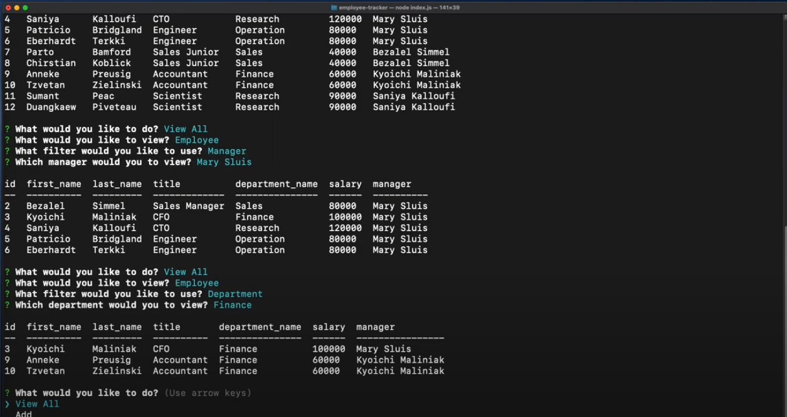

# employee-tracker

## <h2 id="description"> Description </h2>

A command-line application that allows user to a company's employee database, using Node.js, Inquirer, and MySQL.

### <h3 id="preview"> Preview </h3>

The followign video shows how the application can be used from the command line:

## <h2 id="table-of-contents"> Table of Contents </h2>

- [Description](#description)
- [Installation](#installation)
- [Usage](#usage)
- [Tests](#tests)
- [License](#license)

## <h2 id="installation"> Installation </h2>
[(Back to top)](#table-of-content)

### Step 1: Load and install all dependencies

To use this project, first clone the repo on your device using the commands below:

    git clone https://github.com/Supasiti/employee-tracker.git

Then install all the required libraries by running the follow command

    npm i 

### Step 2: Setting up MySQL

After installing all the dependencies, you would need to set up MySQL. An instruction on how to do this on your local computer can be found [here](https://www.mysql.com). After setting up MySQL, you would need to initialise the schema and populate with sample data. Go to the folder, and run MySQL:
  
    cd ~/pathto/employee-tracker
    employee-tracker> mysql -u root -p
    Enter password: 

Once in, you can run the following command:

    mysql> source src/db/schema.sql; source src/db/seeds.sql

and then exit.

    mysql> exit

### Step 3: Connecting employee-tracker to MySQL 

On the root folder, create and open `.env` file:

    employee-tracker> touch .env
    employee-tracker> open .env

In the `.env` file, enter all the following details:

    DB_HOST=localhost
    DB_USER=root
    DB_NAME=employee_db
    DB_PASSWORD=<YOUR-OWN-PASSWORD>
    DB_PORT=3306

## <h2 id="usage"> Usage </h2>
[(Back to top)](#table-of-content)

The access point for the appliction is in the main folder. The application can be run by calling `index.js`.

    cd ~/pathTo/employee-tracker
    node index.js

From there you can follow all the prompts. See a walkthrough [here](#preview).

## <h2 id="tests"> Tests </h2>
[(Back to top)](#table-of-content)

This project uses [Jest](https://jestjs.io) testing framework. This can be set up by running the following command:

    npm i --save-dev

Once the framework is downloaded, To test, run

    npm run test

## <h2 id="license"> License </h2>
[(Back to top)](#table-of-content)

Licensed under the [MIT](https://opensource.org/licenses/MIT) license.
